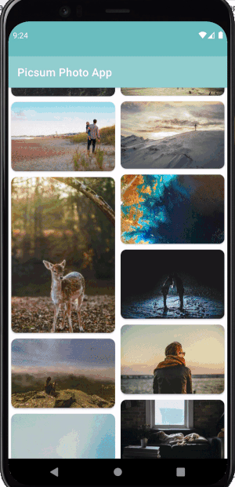

# Picsum Photo App

## Functionality
The app's functionality includes:
1. Fetch a list of images from picsum photos api (https://picsum.photos/) and show them in `RecyclerView` using `StaggeredGrid Layout Manager`.
2. User can view the list of images using smooth infinite scroll.
3. When an image is selected from `RecyclerView` it will load the full-screen image with pinch zoom in/out feature.
4. User can download the image from full-screen view.
5. User can share the image from full-screen view.
6. The image list is cached into local DB, so the list of images are available offline.
7. The app supports `SwipeRefreshLayout` to refresh `RecyclerView` content from remote source.

## Architecture
The app uses clean architecture with `MVVM(Model View View Model)` design pattern. 
MVVM provides better separation of concern, easier testing, Live data & lifecycle awareness, etc.

### UI
The UI consists of two screen
1. `MainActivity.kt` - Initial screen. Shows a list of images.
2. `FullScreenActivity.kt` - Shows full-screen view of the image with additional options.

### Model
Model is generated from `JSON` data into a Kotlin data class.
In addition, entity class has been added for room database.

### ViewModel

`MainViewModel.kt`

Used for fetching picsum images & update livedata. Also send out the status of the network call like Loading, Success, Error using `sealed` class.

`FullScreenViewModel.kt`

Used for downloading the image into a bitmap & save it into internal storage.

### Dependency Injection
The app uses `Dagger-hilt` as a dependency injection library.

The `ApplicationModule.kt` class provides  `Singleton` reference for `Retrofit`, `OkHttpClient`, `Repository` etc.

### Network
The network layer is composed of Repository, ApiService.
`PicsumApi` - Is an interface containing the suspend functions for retrofit API call.

`ImageListRepository` - Holds the definition of the remote/local repository call.

## Building

You can open the project in Android studio and press run.
Android Studio version used to build the project: Arctic fox 2020.3.1

Gradle plugin used in the project will require `Java 11.0` to run.

you can set the gradle jdk in `Preferences->Build Tools->Gradle->Gradle JDK`

## Libraries used
1.  Android appcompat, core, constraint layout, Material Support.
2.  Android View Binding
3. `Hilt` for dependency injection
4. `Retrofit` for REST API communication
5. `Coroutine` for Network call
6. `Lifecycle`, `ViewModel`
7. `LiveData`
8. `Room` for local database.
9. `Glide` for image loading.
10. `Custom fileprovider` for writing & reading files into internal storage.
11. `Swipe Refresh Layout` for pull-to-refresh  `RecyclerView`.
12. `Mockito` & `Junit` for Unit testing.
13. `Robolectric` for Instrumentation testing
14. `Truth` for Assertion in testing.
15. `Photo View` for zoom in/out image.

## Testing

Unit and integration testing has been added for `MainViewModel` , `FullScreenViewModel`, `ImageListRepository` & `ImageListItemSerializableTest`.

### `MainViewModelTest.kt`

Test the viewmodel of the app using `CoroutineRule` & `LiveData Observer`.

The test cases comprise of testing different states like Loading, Success, Error with fake data for testing image list response, cache response.

### `FullScreenViewModelTest.kt`

Test Image donwload returns file uri & URL to bitmap conversion.

### `ListingRepository.kt`

Test the Repository of the app using `Robolectric`.

The test comprises of testing the functionality of Image Room Database like Insertion, Remove, Get saved response etc.

[Mock Webserver](https://github.com/square/okhttp/tree/master/mockwebserver) is used to test the Network api response in case of successful data, empty, failed case.

## Screenshots

Infinite Scroll, Pinch Zoom             |  Image Download                   |   Image share
:------------------------:|:------------------------:|:------------------------
    |    |   

